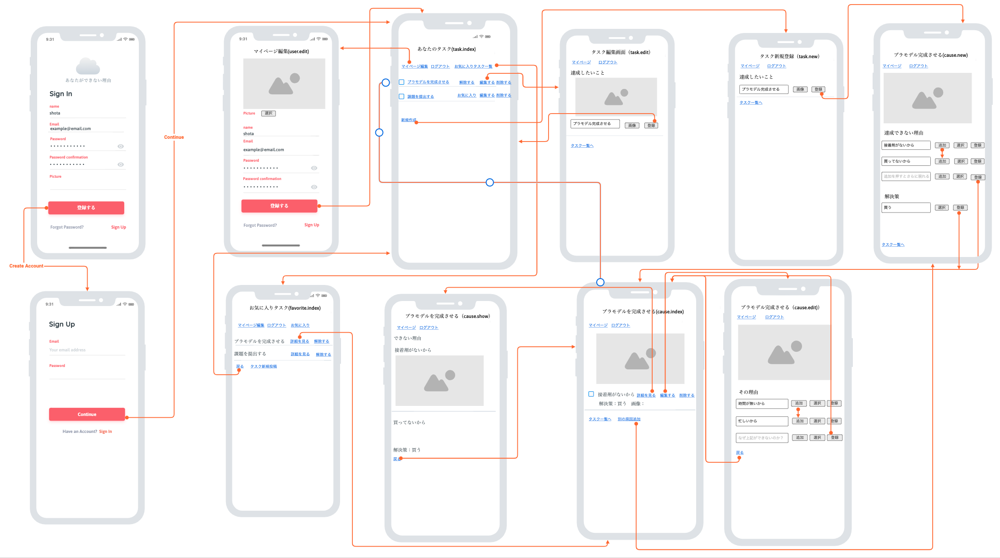
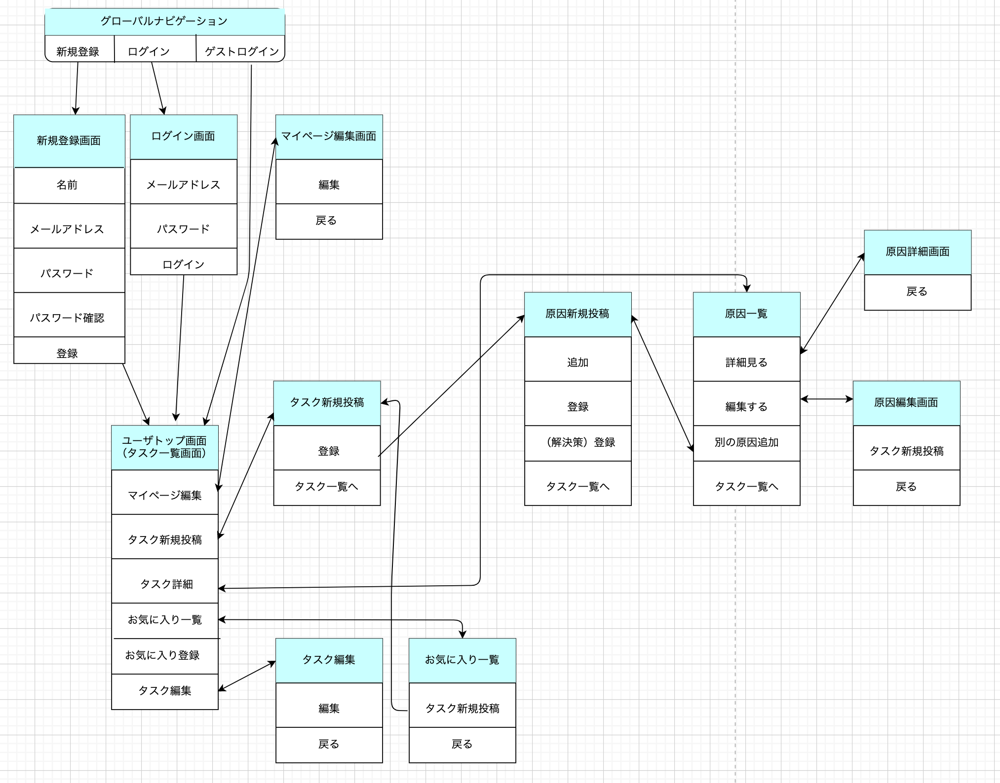

# README

# 開発言語
- Ruby 3.01
- Ruby on Rails 6.1

#就業Termで学んだ技術
- devise
- お気に入り登録
- AWS EC2

#カリキュラム外の技術
- cocoon(gem)

#実行手順
1. $ git clone git@github.com:shota3557/reason.git
2. $ cd reason
3. $ bundle
4. $ rails db:create && rails db:migrate
5. $ rails s

#カタログ設計
https://docs.google.com/spreadsheets/d/1Ky1EspDUwrJZsT7iIfs2utcN2pHQXVmWfcq_ERywstA/edit#gid=1609755414

#テーブル設計
https://docs.google.com/spreadsheets/d/1Ky1EspDUwrJZsT7iIfs2utcN2pHQXVmWfcq_ERywstA/edit#gid=470098050

#ワイヤーフレーム

#画面遷移図

#ER図
